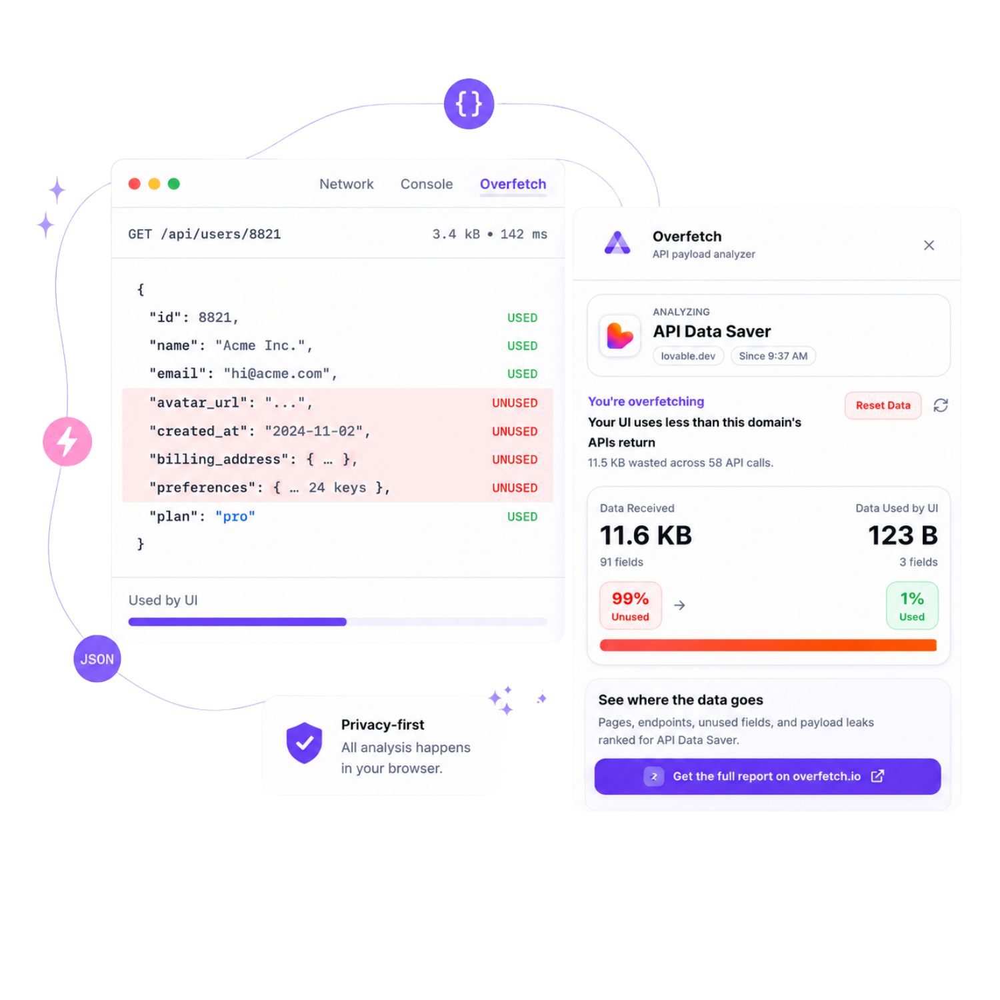

# Overfetch

Chrome DevTools extension that analyzes runtime API payload usage in frontend applications. It intercepts API responses, tracks which response fields are accessed by the UI, and highlights unused fields, payload waste, duplicate requests, and optimization opportunities.

## Website

[overfetch.site](https://overfetch.site)

## App Preview



## Stack

- [WXT](https://wxt.dev)
- React + TypeScript
- Tailwind CSS v4
- Zustand (panel state)
- Lucide React + Recharts

## Development

```bash
npm install
npm run dev
```

Load the extension from `.output/chrome-mv3` (path shown in the WXT dev output), then:

1. Open any page with API traffic
2. Open Chrome DevTools → **Overfetch** panel
3. Interact with the page to trigger `fetch` / XHR / `.json()` calls

## Run Locally (Quick Start)

1. Install dependencies:
   ```bash
   npm install
   ```
2. Start the extension in development mode:
   ```bash
   npm run dev
   ```
3. In Chrome, open `chrome://extensions`.
4. Enable **Developer mode**.
5. Click **Load unpacked** and select `.output/chrome-mv3`.
6. Open a website, open DevTools, and switch to the **Overfetch** panel.

## Architecture

| Entrypoint | Role |
|------------|------|
| `entrypoints/inject.ts` | Main-world instrumentation (`fetch`, XHR, `Response.json`) |
| `entrypoints/content.ts` | `postMessage` bridge → extension messaging |
| `entrypoints/background.ts` | In-memory analytics per tab, duplicate detection |
| `entrypoints/devtools/` | Registers the DevTools panel |
| `entrypoints/panel/` | React analytics dashboard |
| `entrypoints/popup/` | Compact summary + CTA |

## Build

```bash
npm run build
npm run zip
```
